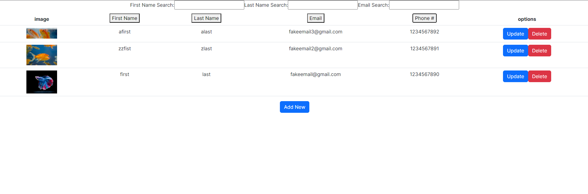

## WeUsThem Takehome Assignment

Uses Express.js backend and MongoDB.

- Restful backend to handle CRUD operations and store data on a database
- Form Validation
- Sorting/searching functionality for the table